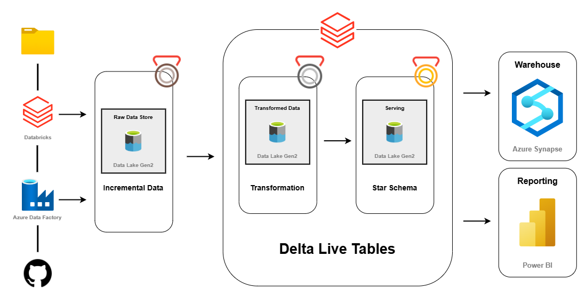

# 🚀 Azure End-to-End Data Engineering Project | Netflix Data Engineering Project using Azure
 ##  Introduction
A complete, production-ready data pipeline showcasing Azure Data Factory, Databricks, Data Lake, Power BI — built using the Medallion Architecture.This project is a comprehensive data engineering solution built on Microsoft Azure, designed to process, transform, and analyze streaming and batch data related to Netflix. It follows a modern data pipeline architecture, leveraging Azure Databricks, Delta Live Tables, Azure Data Factory, and Azure Synapse Analytics to enable scalable, automated, and efficient data processing for business intelligence and analytics.

---

## 📌 Project Overview

This project demonstrates a real-world, scalable **end-to-end data pipeline** using modern Azure services. It follows the **Medallion Architecture** (Bronze, Silver, Gold) and applies best practices in **data ingestion**, **transformation**, **modeling**, and **visualization** within a cloud-based ecosystem. The solution is designed to support incremental data ingestion, optimize data transformation through Delta Lake, and provide structured data models for downstream analytics.

---

## 🧱 Architecture

---

## 🔧 Tech Stack

| Area              | Service/Tool              |
|-------------------|---------------------------|
| Ingestion         | Azure Data Factory        |
| Storage           | Azure Data Lake Gen2      |
| Transformation    | Azure Databricks (PySpark)|
| Modeling          | Star Schema (Fact & Dim)  |
| Serving Layer     | Azure SQL Database        |
| Visualization     | Power BI                  |
| Security & Secrets| Azure Key Vault           |

---

## 🚀 Features

- ✅ **Medallion Architecture**: Bronze → Silver → Gold layers  
- ✅ **Incremental Data Loads** using ADF & watermarking  
- ✅ **Data transformation** using PySpark in Databricks  
- ✅ **Fact-Dimension modeling** in Azure SQL  
- ✅ **Fully interactive Power BI dashboards**  
- ✅ **CI/CD ready architecture** for future enhancements  

---

